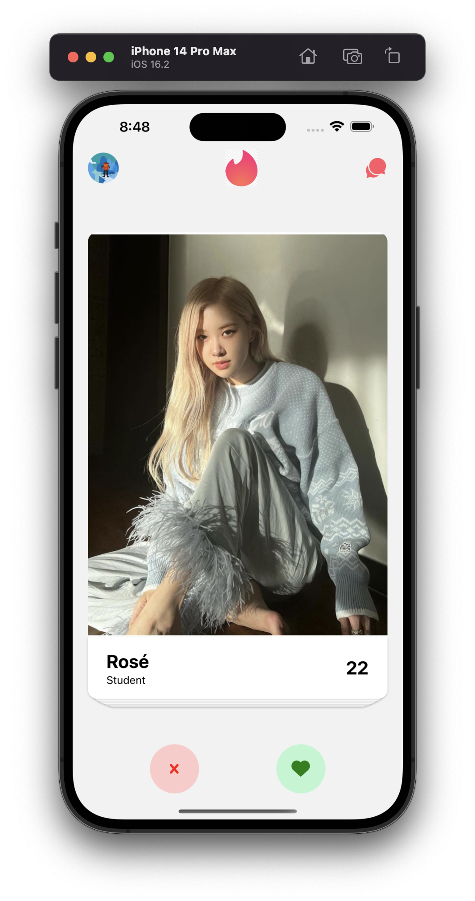

# Tinder clone with `React-Native` + `Firebase` :sparkling_heart:

### Technologies ✨

- `React-Native`
- `Expo`
- TailwindCss with `nativewind`
- `@react-navigation`
- `Firebase` persistent with `AsyncStorage`
- `Expo-auth-session`

### Screenshots & video 🌃

https://github.com/ng-ha/deliveroo/assets/115610452/608bd91b-d458-4172-82f8-a7ab9e9a5854

### License :right_anger_bubble:

[MIT](https://choosealicense.com/licenses/mit/)
